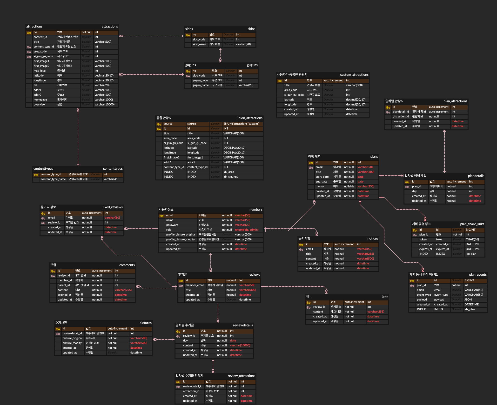
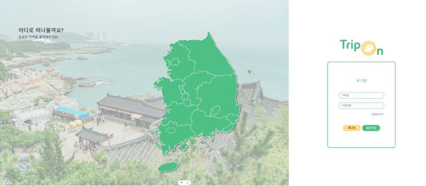
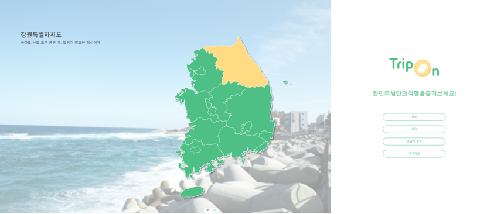
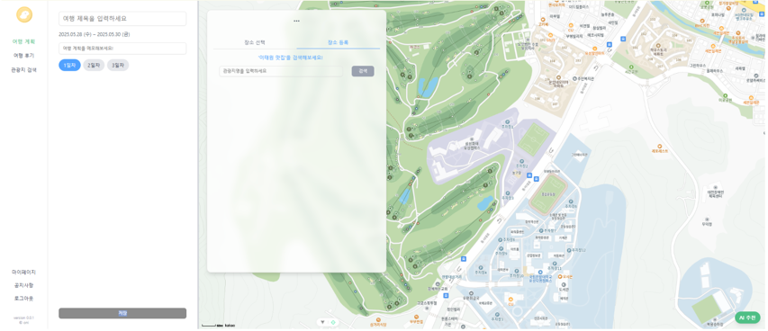
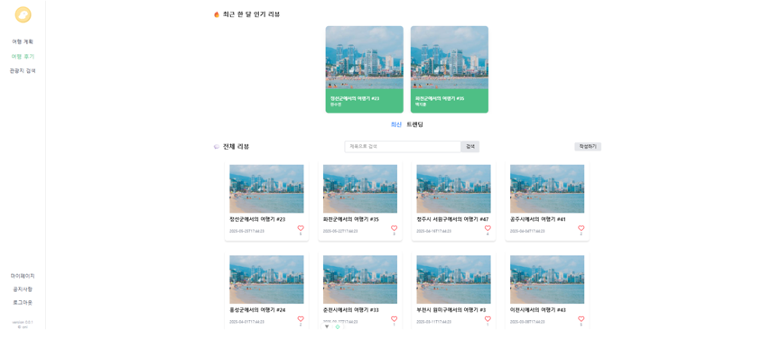
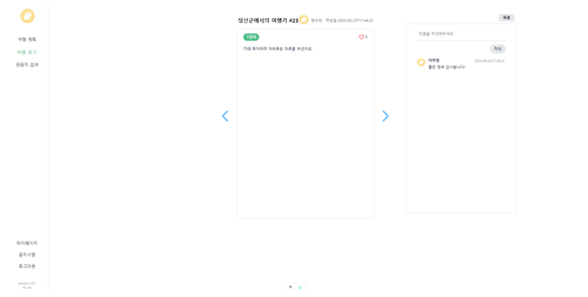
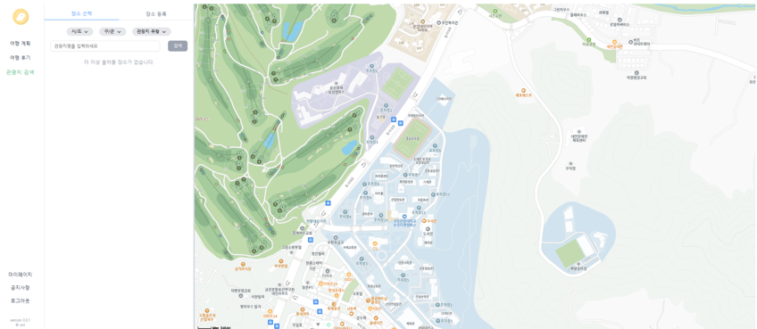
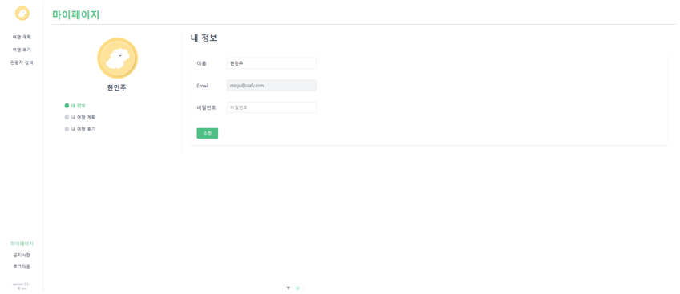

#  TripOn

## 목차
- [🪧 개요 🪧](#-개요-)
- [💫 핵심 기능 💫](#-핵심-기능-)
- [🛠️ 기술 스택 🛠‍](#-기술-스택-)
- [💠 ERD 💠](#-ERD-)
- [🌠 화면 🌠](#-화면-)
- [🎬 시연 영상 🎬](#-시연-영상-)

# 🪧 개요 🪧

TripOn은 **여행 계획을 쉽고 편리하게 생성**하고,   
관리, **공유**할 수 있도록 하는 웹 애플리케이션입니다.   

# 💫 핵심 기능 💫

### ✔ 관광지 등록
+ 공공데이터에 등록되지 않은 관광지를 계획 및 후기에 포함 하고 싶은 사용자들을 위해
직접 관광지를 등록할 수 있는 기능을 제공합니다.

### ✔ AI 계획 생성
+ 여행은 가고 싶지만 계획을 세우는 데 부담을 느끼는 사람들을 위해 원하는 테마와 장소 등을 입력해 일차별 여행 계획을 생성할 수 있습니다.

### ✔ 계획 실시간 동시 편집
+ 여행 메이트와 함께 계획을 편집할 수 있습니다.
+ 편리한 사용을 위해 링크를 생성해 공유하는 방식으로 구현했습니다.

# 🛠️ 기술 스택 🛠

### 💻 Frontend   
+ 프레임워크: Vue 3
+ 상태 관리: Pinia
+ 스타일링: Tailwind CSS
+ HTTP 통신: Axios
+ 지도 서비스: Kakao Maps

### 💻 Backend   
+ 언어: Java
+ 프레임워크: Spring Boot, Spring MVC
+ AI 연동: Spring AI
+ API 문서화: Swagger UI
+ 보안 및 인증: JWT
+ WebSocket: Spring WebSocket, STOMP

### 🗃️ Database & Persistence
+ ORM/SQL 매퍼: MyBatis
+ 데이터베이스: MySQL
+ 세션 관리: Spring Session Redis
+ 캐시/데이터 저장소: Spring Data Redis

### 🛠️ 개발 도구 및 기타
+ 유틸리티: Lombok, Spring Boot DevTools
+ 테스트: JUnit (Spring Boot Starter Test)
+ 개발 툴: VS Code, Figma
+ 빌드 도구: Maven

# 💠 ERD 💠

# 🌠 화면 🌠

### 메인 페이지

   

### 여행 계획

   
### 여행 후기

### 관광지 검색

### 마이페이지

# 🎬 시연 영상 🎬

