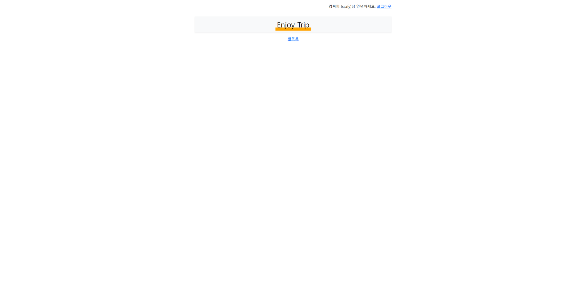
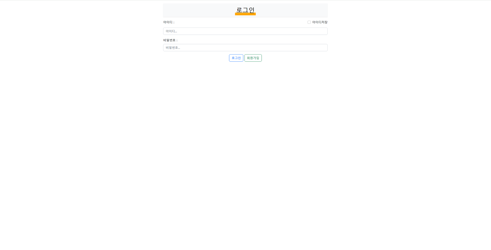
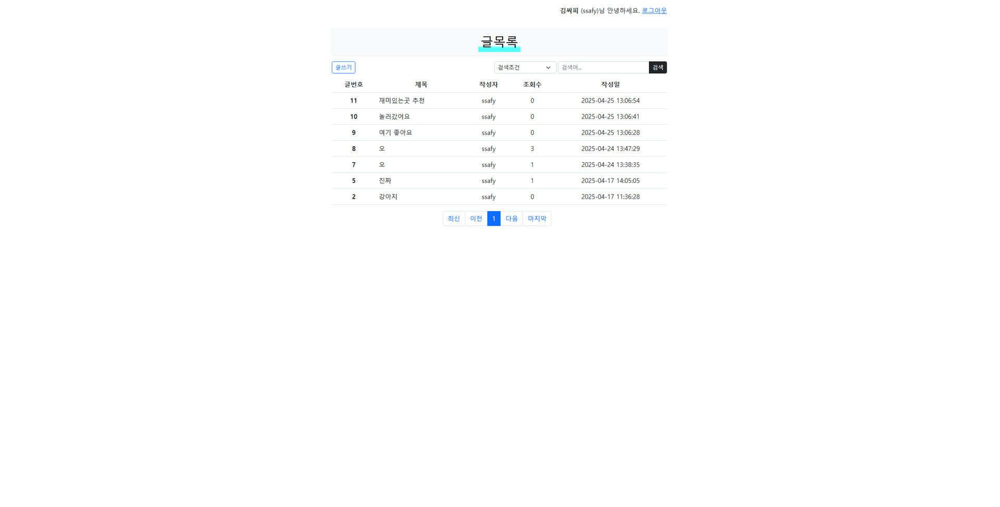
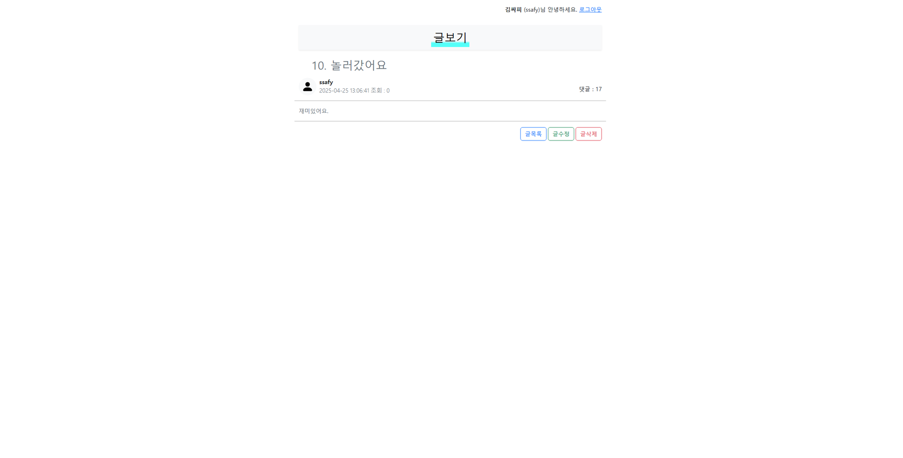

# 🌍 ENJOY TRIP 서비스 프로젝트

## 📝 프로젝트 개요

본 프로젝트는 한국의 다양한 관광지, 먹거리, 축제, 행사 등을 소개하여 지역 관광 활성화를 위한 웹 서비스입니다. 한국관광공사에서 제공하는 국문관광정보서비스\_GW API를 활용하여 사용자에게 지역별 관광지 정보를 제공하고, 여행 계획 수립과 공유 기능을 지원합니다.

## 🛠️ 기술 스택

- **Frontend**: HTML, CSS, JavaScript, Bootstrap

- **Backend**: Java, Spring Boot, Spring MVC, Spring AOP

- **Template Engine**: JSP (Tomcat Embedded Jasper)

- **Persistence**: MyBatis 3.0.3

- **Database**: MySQL

- **API 문서화**: Swagger

- **유틸 및 기타**: Lombok, Devtools, JUnit

- **개발 도구**: VS Code, Figma, Maven

- **데이터 소스**: 한국관광공사 국문관광정보서비스\_GW API

## ERD

## 🖼️ 화면

메인 페이지

로그인 페이지

글 목록

글 단건 조회

